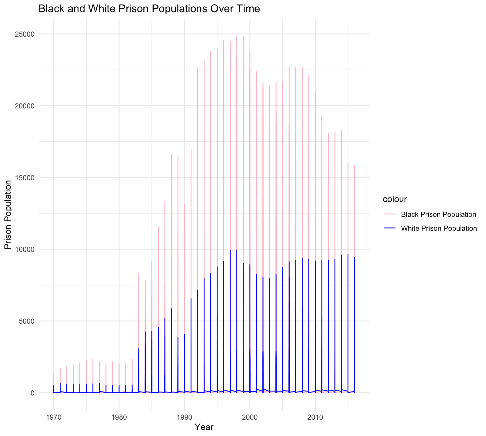
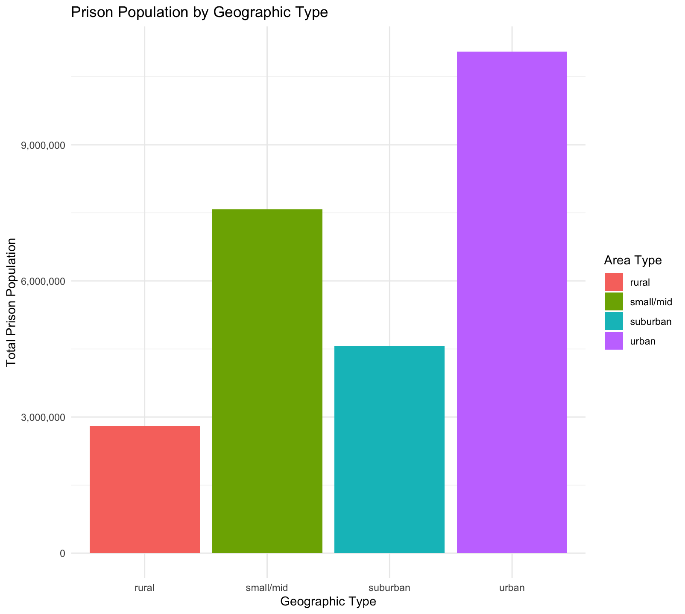
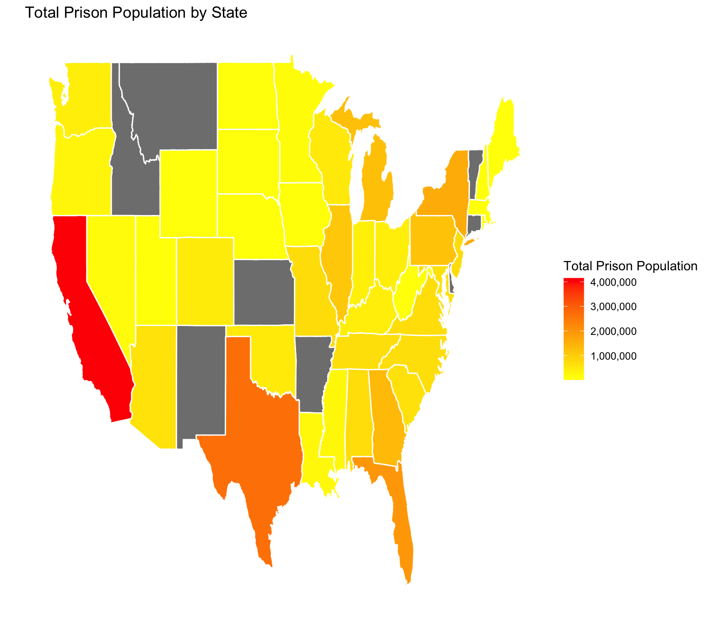

### Introduction
Racism is still a rampant issue in the United States. One of the prime pitfalls
of this system is injustice is the United States prison system. For example, 
certain communities are over-policed. The Vera Institute studied just this. In this report, I analyzed the incarceration data collected by Vera Institute
to create charts that display this inequity. 

### Summary Information

**5 values calculated from my summary information R script:**

- *Race with the highest total prison population:*
'r prison_pop %>% summarize(across(ends_with("_prison_pop"), sum, na.rm = TRUE)) %>% gather(key = "race", value = "total") %>% arrange(desc(total)) %>% slice(1) %>% pull(race)'

- *Highest prison population county:*
'r prison_pop %>% filter(total_prison_pop == max(total_prison_pop, na.rm = TRUE)) %>% pull(county_name)'

- *Lowest prison population county:*
'r prison_pop %>% filter(total_prison_pop == min(total_prison_pop, na.rm = TRUE)) %>% pull(county_name)'

- *County with the lowest prison population:*
'r prison_pop %>% filter(total_prison_pop == min(total_prison_pop, na.rm = TRUE)) %>% pull(county_name)'

- *County with the highest prison population:*q
'r prison_pop %>% filter(total_prison_pop == max(total_prison_pop, na.rm = TRUE)) %>% pull(county_name)'

### The Dataset

- **Who collected the data?**  

    The data was collected by the Vera Institute.

- **How was the data collected or generated?**  

    It was collected through public records, surveys, etc.

- **Why was the data collected?**  

    It was collected to analyze patterns of incarceration through a social justice lense.

- **How many observations (rows) are in your data?**  

    47976 observations

- **How many features (columns) are in the data?**  

    39 columns

- **What, if any, ethical questions or questions of power do you need to consider when working with this data?**

    Of course when dealing with systems of society, we need to acknowledge ethical questions of race, racial disparity, history, and more. 

- **What are possible limitations or problems with this data?** 

    There are many possible limitations or problems. For instance, as discussed in our class readings, there is always the debate over whether strictly numerical data will ever be the right way, since humanity is inherently emotional and empathy is necessary to be just for all. Statistically, some limitations or problems could be that there were a lot of NA values, and of course there are definitely cases of incarceration that are not covered by the Vera Institute. Since the prison systme is so widespread and huge, it is probably difficult to account for every single person.

### Trends Over Time Chart

I included this chart because it shows the sheer difference between prison populations between black and white people. The x-axis is time, so the reader can see the progression of time and how the y-axis variable, prison population, shifts. As you can see, there is a constant trend of black populations being heavily more imprisoned than the white counterparts, suggesting over-policing in the United States. 

### Variable Comparison Chart

My next chart is a bar chart. I was inspired by the redlining topic from our lectures and reading, so I compared 4 variables-- rural, small/mid cities, suburban, and urban areas. It's interesting to see how racism can even play a factor in regions and housing. I decided to focus on the the total prison population in the US as a whole, and to see what kind of regions would have the most prison inmates. The pattern depicted in the data shows that urban areas have the most prison population, which is interesting because on average, the more rural an area is, the less diverse it will be. Urban areas have the greatest diversity.

### Map

For my last chart, I wanted to depict the United States prison population through a heat map to show the concentration of prison population. Kind of similar to the bar graph, it shows that areas that are more populated have a higher prison population.
